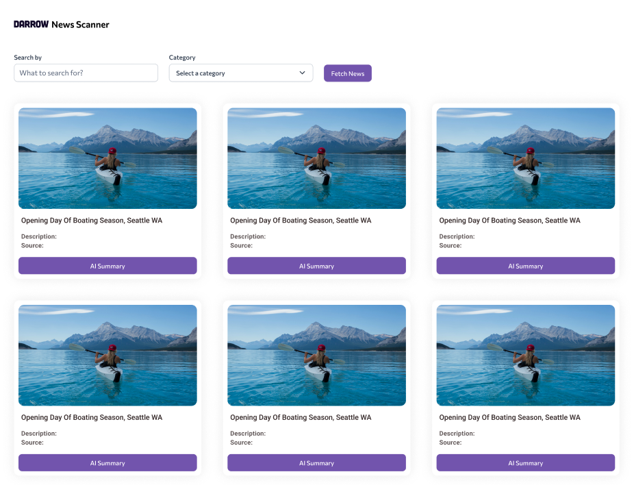
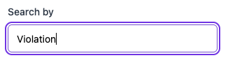
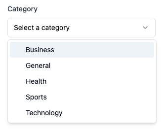
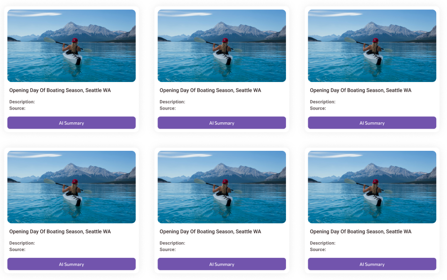
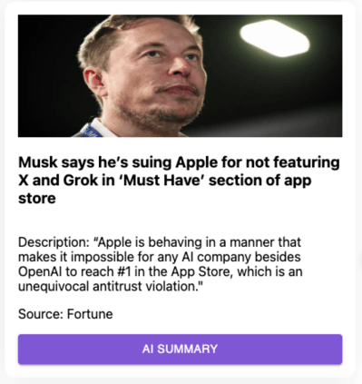
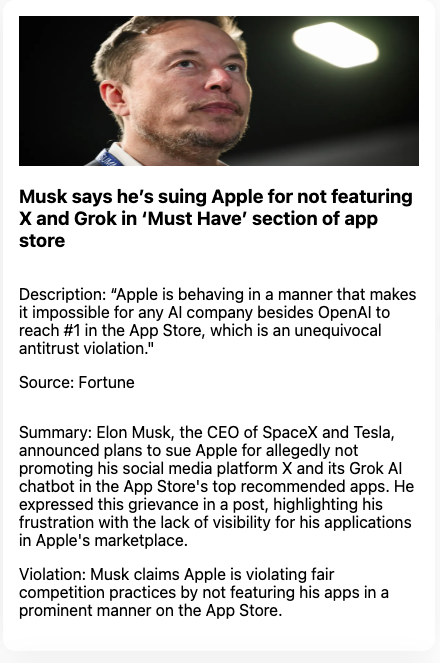

# Darrow – News Scanner (Fullstack Assignment)

[View the Figma design for the News Scanner](https://www.figma.com/design/UYdHjLWHQlQSEBbWJ9RYXF/News-Scanner?m=dev)

One of the many things we do at Darrow is scan the news for legal violations 🙂.  
In this exercise, we aim to create a news legal violation scanner page that displays recent news and utilizes an LLM to detect legal violations.

We will fetch the news articles from [newsapi.org](https://newsapi.org).  
Please register to [newsapi.org](https://newsapi.org) to get your API Key!



### Step 1: QueryInput

`<QueryInput />` is a simple input-controlled component.  
It accepts a `value` and an `onChange` method from the outside.



---

### Step 2: CategorySelect

`<CategorySelect />` is the category filter (show just the news of the selected category).

Fetch the available categories from the server API at `/api/categories`.



---

### Step 3: NewsDisplay

Clicking the **Fetch News** button should fetch the news articles from our API at `/api/news` and display them in a grid.

For this assignment, type **“Violation”** in the search input.

#### Server

1. For the category you chose (Step 2), retrieve all sources that are in **English** and originate from the **United States**.
2. Filter to use only the first **5 sources**.
3. Fetch **all news** (not just headlines) from these 5 sources.
4. Fetch **6 articles per page**.

#### Client

For each article, show a news card containing:

- Image
- Title
- Description
- Source
- **AI Summary** button (see Step 4)

Implement an **ENDLESS SCROLL**: when the user reaches the end, fetch the next 6 items until there are no more.





---

### Step 4: AI Summary

Clicking the **AI Summary** button enhances the article with:

- a **3-sentence summary** of the article, and
- a **1‑sentence description** of the violation the article refers to.

Create a new API endpoint that accepts the article content, injects it into an LLM, and returns this JSON shape:

```json
{
  "summary": "<3 sentences of summary>",
  "violation": "<1 sentence of the specified violation in this article>"
}
```

Please use `openai.service.ts` — it is a wrapper over OpenAI and shares the same API. 
Please use the **OpenAIKey** we provided you there.



---

## Additional Notes

- External libraries are okay.
- Have a basic API design in mind.
- Think about security — **do not commit sensitive API keys**.
- The design should be pixel‑perfect as shown in Figma.
- **NOTICE:** The code should be **production grade**

---

## Code Template

### This starter template includes

#### 1) Client (React)

- `<CategorySelect />`, `<QueryInput />`, and `<FetchNewsButton />` components.
- Basic CSS styling files.
- `http-client.ts` — an Axios instance for making API calls. The base URL (`localhost:5000`) is already configured, so you only need to import it and call the API, e.g.:

```ts
import axiosInstance from "./http-client";

axiosInstance.get("/api/news");
```

#### 2) Server (ExpressJS)

- Initial server and router implementation.
- A mock `categories` file.
- `openai.service.ts` — a wrapper around OpenAI. Insert the **OpenAIKey** you received here.
- Typings for the NewsAPI API.

---

## Getting Started

1. Install dependencies

```bash
npm run install:all
```

2. Start both the server and the client

```bash
npm run start
```

3. Once you're done, please submit the task <a href="https://forms.gle/TGKemaZKGJgvJumDA" target="_blank" rel="noopener noreferrer">here</a>.  
   Make sure all `node_modules` are removed by running

```bash
npm run clean:all
```

**Good luck!**
